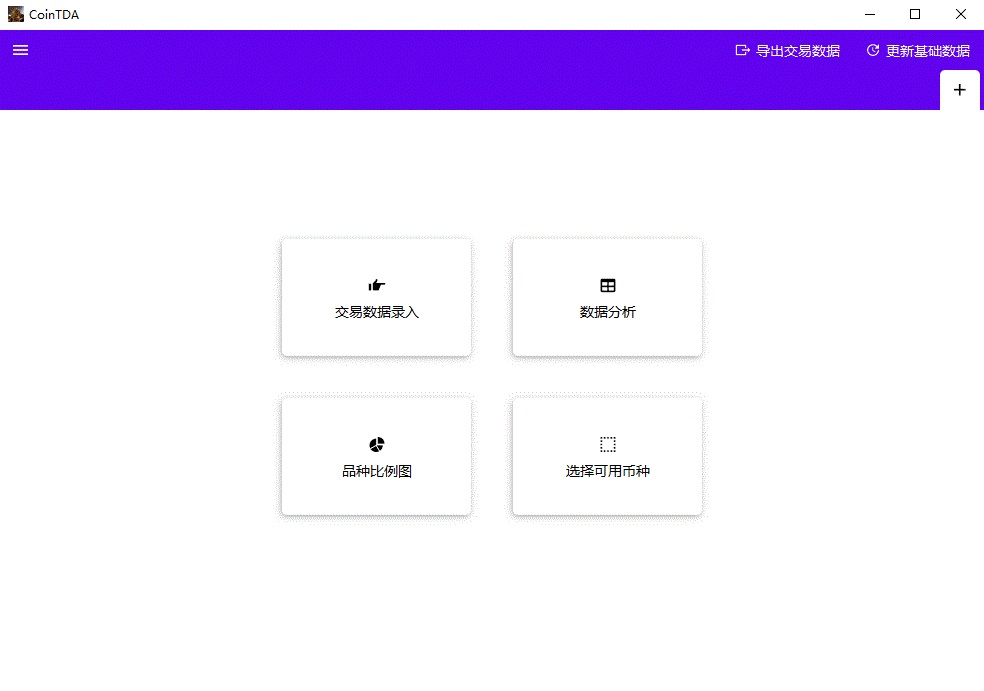
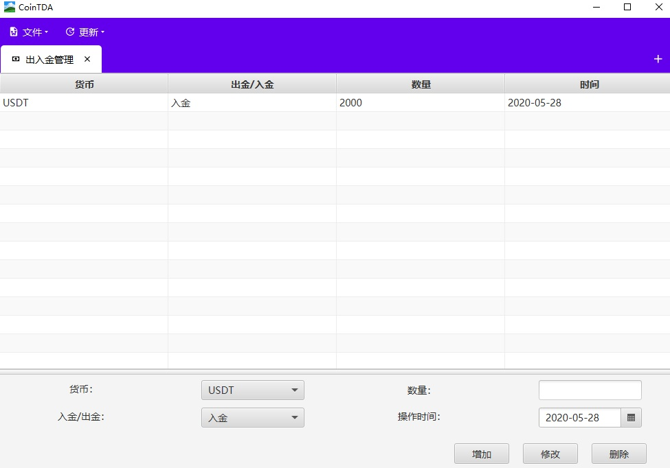
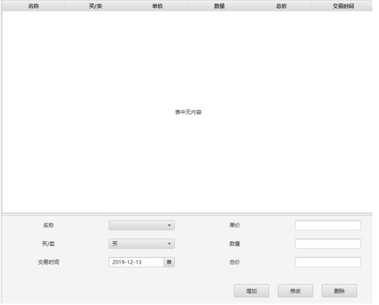
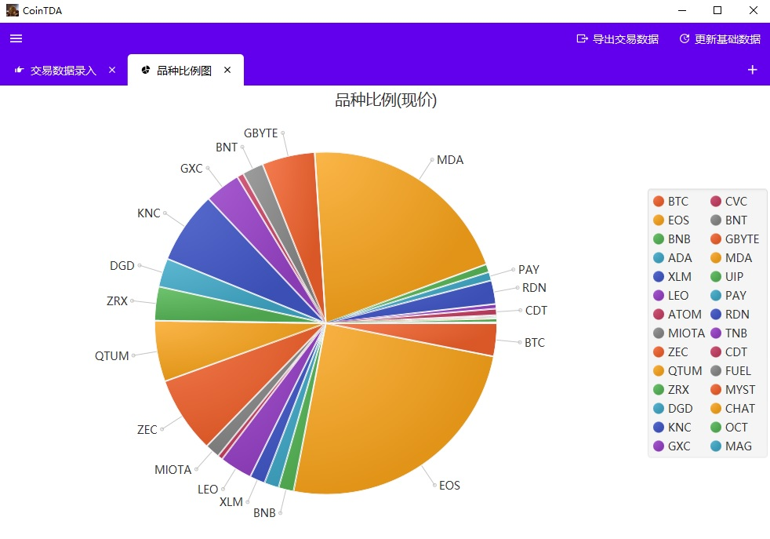
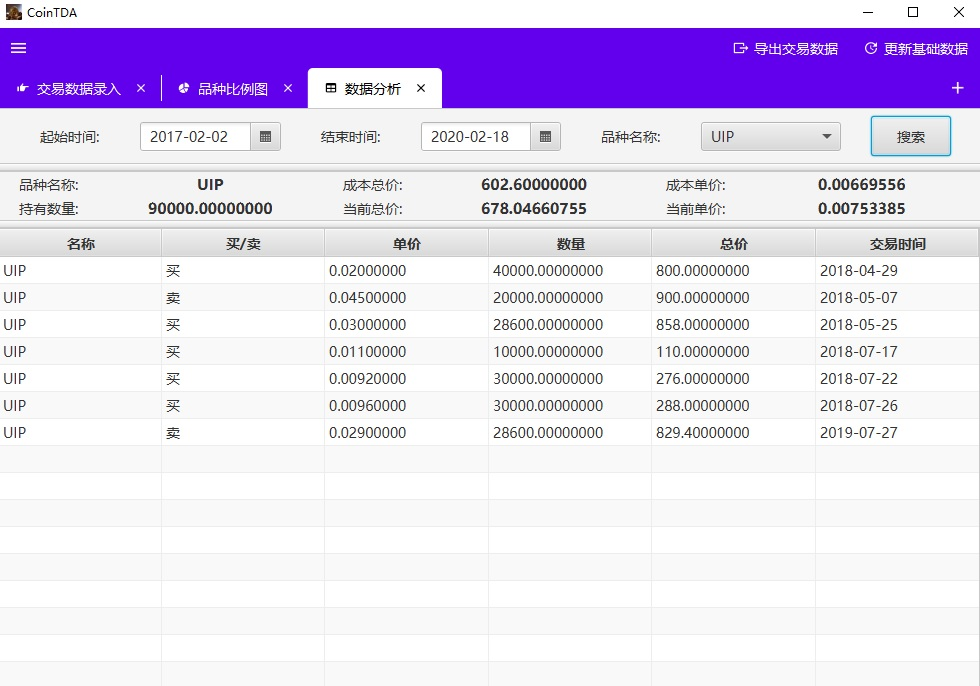
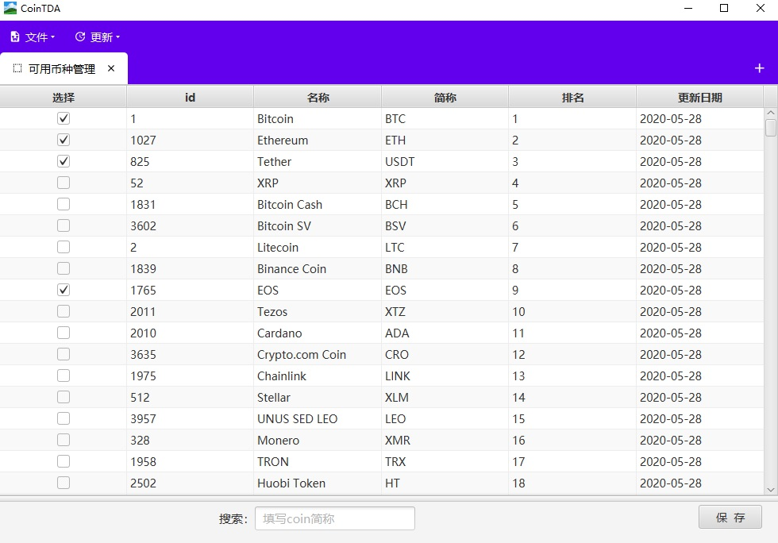
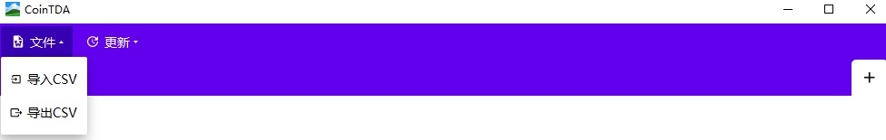
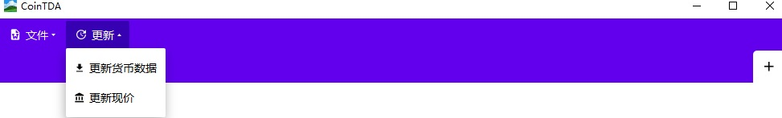
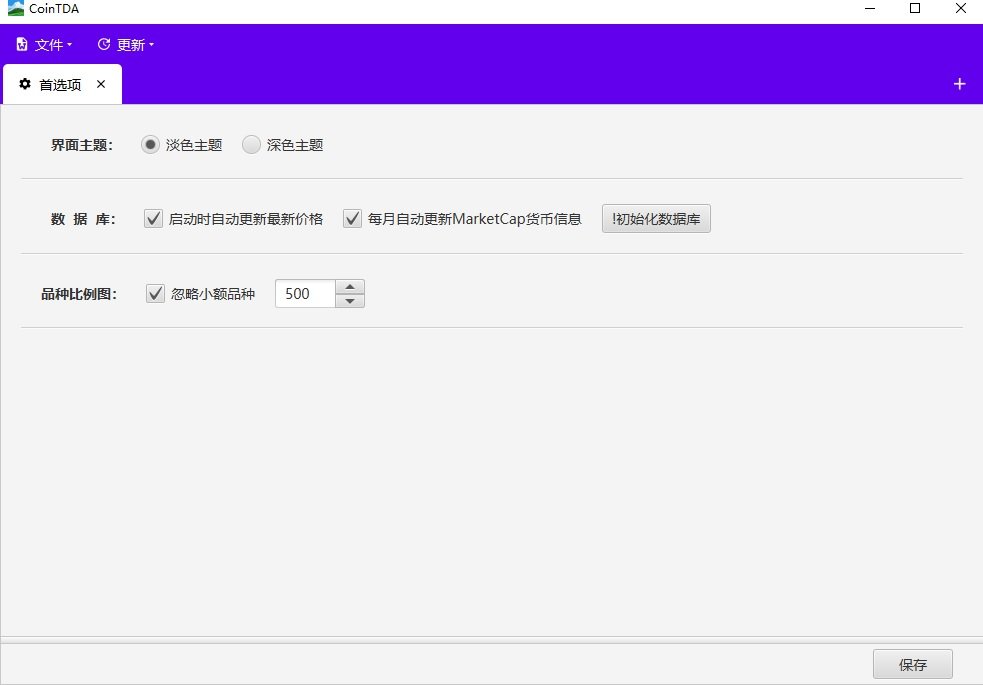

= CoinTDA: 简介
:author: mapleafly
:doctype: article
:encoding: utf-8
:lang: en
:toc: left
:numbered:
:revnumber: 2.3.4
:revdate: 2021-03-18
:revremark: 
:version-label!: 
:title: CoinTDA简介

CoinTDA是一个虚拟货币交易信息记录和分析工具。本简介帮助读者快速了解CoinTDA。

这里下载安装文件 https://github.com/mapleafly/CoinTDA/releases/download/v2.3.0/CoinTDA-Setup.exe[CoinTDA-Setup.exe]到计算机

== 版本记录

版本: {revnumber}

版本发布日期: {revdate}

版本信息: 

. 修改列表排序方式，按照简称排序

== 各种烦恼的问题

. 你是否购买了n（n > 5）种Coin或Token？
. 你是否从n(n > 1)个交易所交易？
. 你是否对某一品种多次交易？
. 你是否遭遇过交易所交易数据丢失？
. 鉴于以上某点或者全部，你是否想有一个个人的交易信息记录工具，并且能够帮你统计分析一下综合成本之类的数据？

== 功能说明

. 记录交易信息
. 查询某品种的交易信息
. 统计某品种的综合购入成本、个人存量、当前价值
. 图表直观显示各品种所占投资比例
. 导入导出交易数据(csv格式)

== 特点

. 桌面端应用，数据在本地
. 基础数据采用 https://coinmarketcap.com/[coinmarketcap]的数据
. 开源免费
. 小巧简单

== 截图

* 初始界面

* 出入金管理界面 

* 交易数据管理界面 

* 数据图例效果

* 数据分析 

* 可交易品种管理界面

* 数据文件导入/导出 

* 更新基础数据和当前价格 

* 首选项设置界面

* 记事本界面

image::img/10.jpg[记事本界面]

== 安装使用

. 下载安装文件 https://github.com/mapleafly/CoinTDA/releases/download/v2.3.0/CoinTDA-Setup.exe[CoinTDA-Setup.exe]到计算机
. 双击运行CoinTDA-Setup.exe
. 按照安装步骤操作，你可以一直“下一步”直到完成安装。
. 找到安装目录，windows默认安装目录在C:\Program Files (x86)\CoinTDA
. 准备修改目录下的conf\Cryptocurrency.yml文件
. 访问 https://coinmarketcap.com/api/[coinmarketcap]
. 注册一个帐号，申请一个api key
. 把apikey保存到安装目录下的conf\Cryptocurrency.yml文件

    文件中的第二行apiKey: 默认没有值，把申请的apikey放在这一行的冒号后面
    注意：冒号和你要输入的apikey之间要有一个空格

. 运行cointda.exe
. 更新基础数据

    安装配置完成后，第一次开始使用，首先执行“更新-更新货币数据”    
    
. 点击“可用品种管理”模块，选择将来要交易的品种并保存。

    因为Coin品种太多，软件默认没有选择可交易品种。初次使用软件，更新基础数据后，
    需要先执行此功能。这样才能在录入界面选择Coin。将来随着交易品种增多，可以在这里
    继续增减。

. 去出入金管理界面输入入金信息。
. 去交易数据管理界面录入输入交易信息。
. 数据分析和图例查询统计数据。
. 首选项模块可以设置各种参数。

== 开发者

本项目开发所用：

. https://adoptopenjdk.net/?variant=openjdk11&jvmVariant=hotspot[AdoptOpenJDK 11.05]
. https://gluonhq.com/products/javafx/[openjfx 11.0.2]
. https://maven.apache.org/[maven]
. 其他依赖见 https://github.com/mapleafly/CoinTDA/blob/master/pom.xml[pom.xml] 

== maven

. 运行  clean javafx:run
. 打包  clean install

